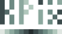
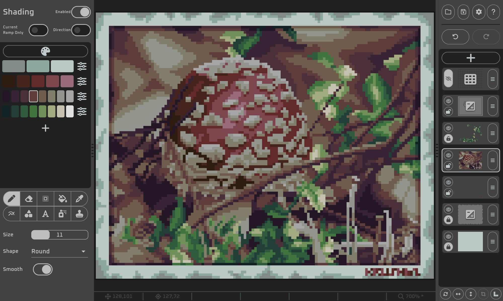

### *KPix: A pixel art creation tool.*

## Contents

- [About](#about)
- [Features](#features)
- [Controls](#controls)
- [Installation](#installation)
- [Build](#build)
- [Roadmap](#roadmap)
- [Feedback](#feedback)
- [License](#license-and-privacy)

## 🚀About
KPix is a pixel art editor for still images with a focus on generative color ramps and shading. The key aspects are:
- exclusive use of indexed colors
- generative color ramps based on parameters
- hsv based color representation
- shading capabilities for all tools
- reference layers
- grid/perspective aid layers
- shading layers
- non-destructive layer effects (outer/inner strokes, shadow, glow, ...)
- image importing including automatic palette creation
- multi-platform support (Windows, Linux, Android, Web)
- stylus and touch support
- automatic light/dark theme

You might also want to read the [F.A.Q.](faq.md)

## 🔥Features
### Drawing Tools
- Pen
- Shape
- Text
- Fill
- Stamp
- Line / Bézier Curve
- Spray Can

### Shading
The drawing tools work directly (using the selected color) or in shading mode. In shading mode, the affected colors on the canvas are brightened/darkened based on the current color ramp.

### Generative Palette
A palette consists of multiple independent color ramps. Each ramp can have an arbitrary amount of shades (colors). These shades are controlled by parameters:
- base hue (hue of the center shade)
- base saturation (saturation of the center shade)
- hue shift between shades
- saturation shift between shades
- saturation curve (keep darker/brighter shades constant)
- minimum and maximum brightness

Palettes can be saved using the kpal format which is also used by [KPal](https://github.com/krush62/KPal). The file format documentation can be found [here](docs/kpal_file_format.md).

### Special Layers
#### Reference Layers
Add reference images to your project and put them anywhere in your layer stack. These layers support opacity, scaling, moving and stretching.
#### Shading Layers
Non-destructive shading for your image. Test different shading variants without changing the content.
#### Grid/Perspective Layers
Displaying a highly-customizable grid (rectangular, diagonal, hexagonal, triangular, isometric, brick) or perspective aid (1-point, 2-point, 3-point).

### File Format Support
KPix uses its own kpix format for storing project files. The file format documentation can be found [here](docs/kpix_file_format.md).
#### Export Formats
##### Image Formats
Projects can be exported to uncompressed images including transparency. Integer scaling is supported.
- png
##### Application Formats
Projects can be exported for usage in other applications. Palettes and layers will be included.
- aseprite (Aseprite)
- xcf (Gimp)

Palettes can be exported for usage in other applications.
- png
- aseprite (Aseprite)
- gpl (Gimp)
- txt (Paint.NET)
- ase (Adobe)
- pal (JASC)
- xml (Corel)
- soc (Star/Open/Libre Office)

#### Import Formats
Due to its unique way of having parameterized color ramps, an import of other formats always needs the creation of parameterized color ramps from the image's colors.
Any import is an approximation and will never exactly match the colors given in the original image.\ 
The following raster image formats are supported: bmp, jpg, gif (first frame) and png.

## 🎮Controls
This application supports input by mouse/keyboard, touch screen and stylus.
The complete control table can be found [here](docs/controls.md).

### Quick Start
| ACTION                                     | MOUSE               | TOUCH            | STYLUS                           |
|--------------------------------------------|---------------------|------------------|----------------------------------|
| use tool                                   | left click          | one finger       | down                             |
| move canvas                                | middle click + move | two finger move  | button press + move              |
| zoom canvas                                | mouse wheel         | two finger pinch | button long press + move up/down |
| color pick /   switch shading direction | right click         | ---              | quick button down and up         |

## 💾Installation
All release versions can be found at [latest releases](https://github.com/krush62/KPix/releases/latest).

### Windows
There are two ways to run KPix on Windows:
#### Installer
Download and run the provided Windows installer. The application can be easily uninstalled and a file association is created.
#### Package (zip)
This is a portable version. Extract the contents of the Windows Zip Package and run kpix.exe to start the application.

### Linux
Extract the contents of the Linux tar.gz Package and run kpix to start the application. This version needs to have `libgtk-3-0`, `libblkid1` and `liblzma5` installed and for file/directory selection, `zenity`, `qarma` or `kdialog` is needed.

### Android
#### Manual Installation
Download the Android apk file and install it manually.\
*Even though, the apk can be installed on any device with the minimum required Android version, the application is designed for tablets (preferably with a stylus). [The manifest file](android/app/src/main/AndroidManifest.xml) specifies the supported screen sizes and densities.* 

[//]: # (### macOS)
[//]: # (### iOS/iPadOS)
### Web Version
A html/javascript version can be found at kpix.cloud ([link](https://kpix.cloud)). The web version has some limitations:
- General performance is lower compared to the native versions
- No project manager (simple load and save via up/download)
- No palette import
- Limited stylus and keyboard shortcut support

## 💻Build

- Clone the repository
- [Install the Flutter SDK](https://docs.flutter.dev/get-started/install)
- Open the project in your configured IDE or use gradle directly to build your variant
- you might use the scripts in the release_tools folder to create Linux/Windows/Android/Web versions

## 🔜Roadmap
A list of ideas and features for future versions can be found here: [#53](https://github.com/krush62/KPix/issues/53). Prioritizing of items will happen when alpha tests were performed.

## 🤝Feedback
Feedback can be shared via the [discussions page](https://github.com/krush62/KPix/discussions). Please make sure to check if your idea/bug already exists.

## 📃License and Privacy
This project is licensed under [AGPLv3](LICENSE).\
Please read the [privacy statement](PRIVACY.md).

